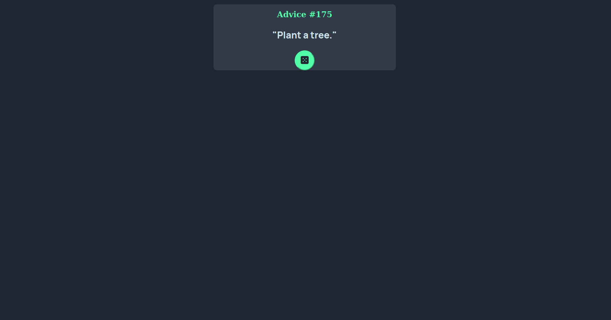

# Frontend Mentor - Advice generator app solution

This is a solution to the [Advice generator app challenge on Frontend Mentor](https://www.frontendmentor.io/challenges/advice-generator-app-QdUG-13db). Frontend Mentor challenges help you improve your coding skills by building realistic projects.

## Table of contents

- [Overview](#overview)
  - [The challenge](#the-challenge)
  - [Screenshot](#screenshot)
  - [Links](#links)
- [My process](#my-process)
  - [Built with](#built-with)
  - [What I learned](#what-i-learned)
  - [Continued development](#continued-development)
  - [Useful resources](#useful-resources)
- [Author](#author)

## Overview

### The challenge

The purpose of this little project was to construct a small one-page application that can provide random suggestions using an API. 

### Screenshot

### Links

- Solution URL: [Add solution URL here](https://github.com/UrbanskiDev/FrontendMentor-Advice-Generator-App)
- Live Site URL: [Add live site URL here](https://frontend-mentor-advice-generator-app-snowy.vercel.app/)

## My process

The first thing I wanted to accomplish was to be able to produce random advise using the suggested API.  I began by making a few tests on Insomnia, prior to executing it with Javascript and Fetch API. Whenever that was finished, I just needed to finish the pre-constructed HTML document and make the relating CSS.
### Built with

- Semantic HTML5 markup
- CSS custom properties

### What I learned

I have figured out how to make a sparkling button. From the start, I didn't figured it would cause a very remarkable issue, yet it tooks me a smidgen of time to sort out some way to make it. Other than that, the remainder of the venture was genuinely simple to make, which I suggest for a novice.

### Continued development

I will go on with more perplexing undertaking on FrontendMentor, which would make me utilize a greater amount of my expertise. Perhaps some "PRO" projects which appears to be extremely fascinating to do. I would likewise to work more on responsive site, since I didn't have a lot of to accomplish, and I feel like I have a few challenges.

### Useful resources

- [Ressource for glowing button](https://codersblock.com/blog/creating-glow-effects-with-css/) - This helped me to make my button glowing when a user hover on the generator button XYZ reason.

## Author

- Website - [Anthony](https://www.your-site.com) Website not yet existing at the moment of the project
- Frontend Mentor - [@UrbanskiDev](https://www.frontendmentor.io/profile/UrbanskiDev)